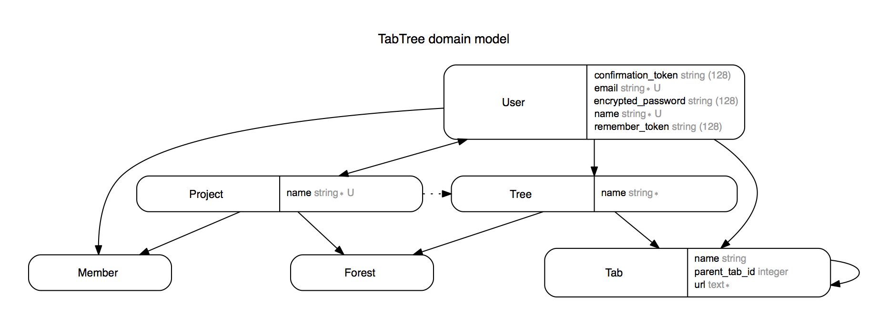

##ReRoot

Visit [ReRoot](https://reroot.herokuapp.com/) to see a live version of the site.

Feel free to reach out to me with questions or suggestions at my email

Description

ReRoot is intended to help organize, plan, and save research projects in a logical tree-like structure. ReRoot lets users save websites they visited while researching a particular topic and connect them to create a visual representation of their research path--that is, where they started in their research, and how they reached the particularly relevant article. This is a desirable setup for many areas of research (like legal research) where many sources depend on each other. Having a visual representation of one's research path helps a user organize their collection of research and also easily identify the more pivotal articles from which further research stemmed.

In addition to creating one's own research project, multiple researchers can work together and contribute research to a larger project. Each project has a project leader with a few special privileges such as booting members, transferring leadership, and deleting the entire project. Members can add other users, and can leave on their own volition.

Libraries and Technologies

Ruby 2.3
Rails 5.0
React-rails 1.8.1 for performance improvements
jQuery-rails 4.1.1 for tab expandability/collapsibility & search highlighting/filtering
Clearance for authentication.
Skeleton for a minimalistic front-end framework.

